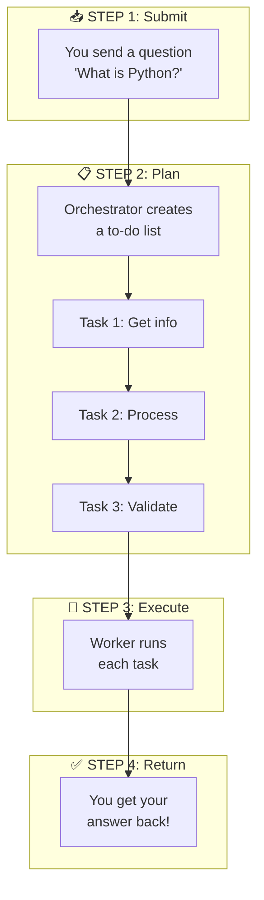
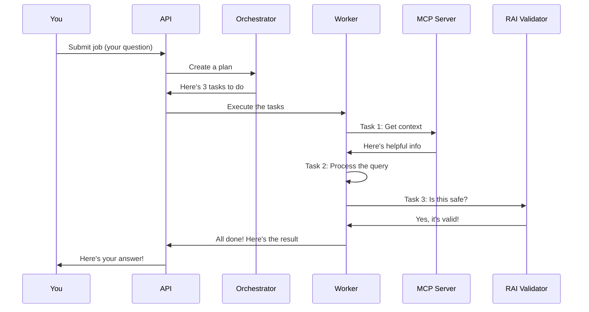
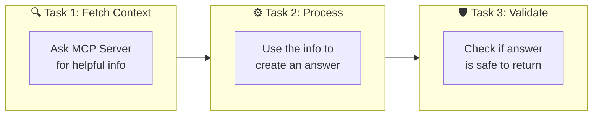
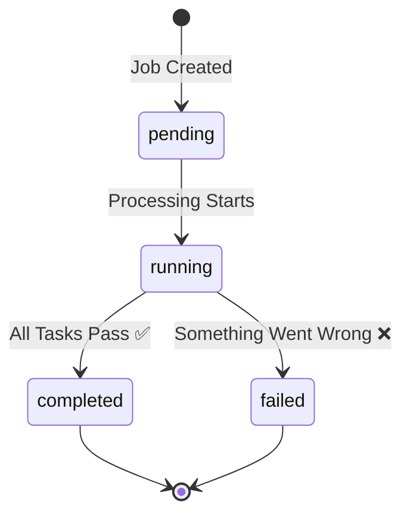
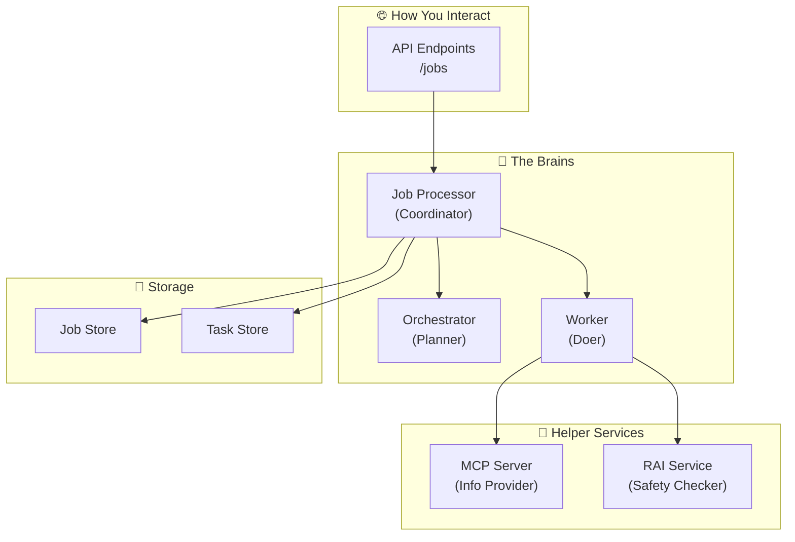
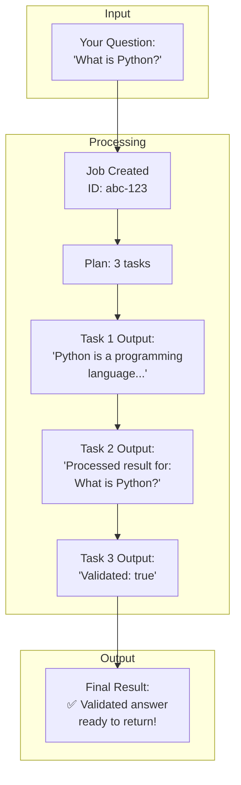
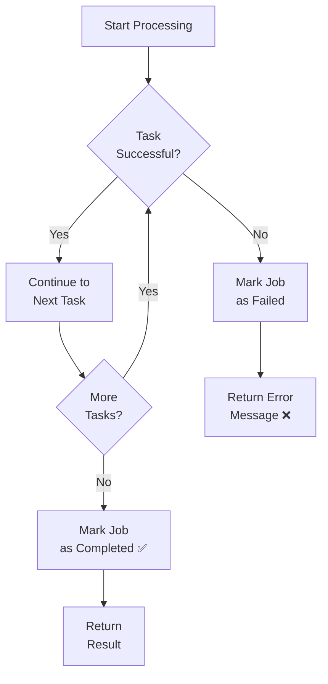
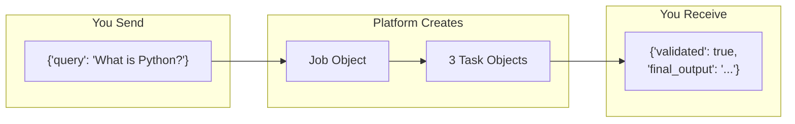
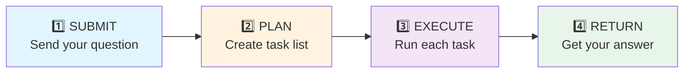

# Agent Platform - Visual Workflow Guide

Simple visual diagrams explaining how the platform works.

---

## The Big Picture


**In plain English:** You send a request → The platform processes it → You get a result back.

---

## Complete Workflow



---

## What Happens Inside



---

## The Three Tasks Explained



**Task 1 - Fetch Context:** "Hey MCP, what do you know about this topic?"

**Task 2 - Process:** "Let me combine the question with the context to make an answer"

**Task 3 - Validate:** "Is this answer safe? No passwords or bad stuff?"

---

## Job Status Flow



**pending:** Job is waiting to start  
**running:** Platform is working on it  
**completed:** Success! Here's your result  
**failed:** Oops, something broke  

---

## Component Overview



---

## Real Example Walkthrough



---

## Error Handling



---

## Data Flow



---

## Summary: The 4 Simple Steps



That's it! The platform takes your question, plans how to handle it, does the work, and gives you a safe, validated answer.

---

## Try It Yourself!

```bash
# Send this to the API
curl -X POST http://localhost:8000/jobs \
  -H "Content-Type: application/json" \
  -d '{"data": {"query": "What is Python?"}}'
```

Watch the magic happen! 🎉
